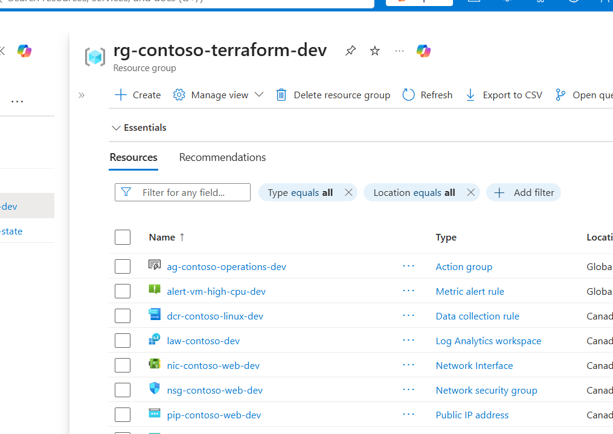
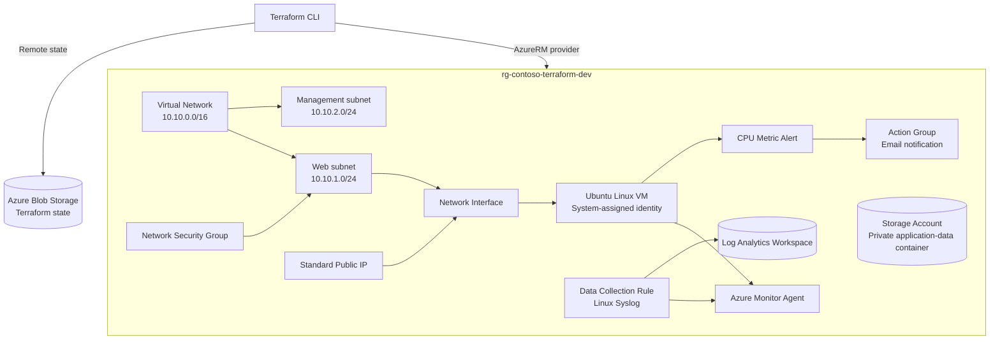
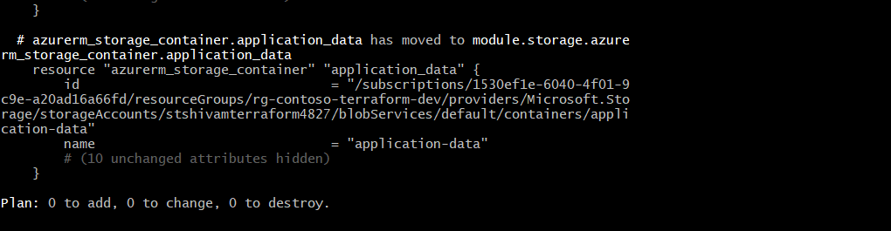
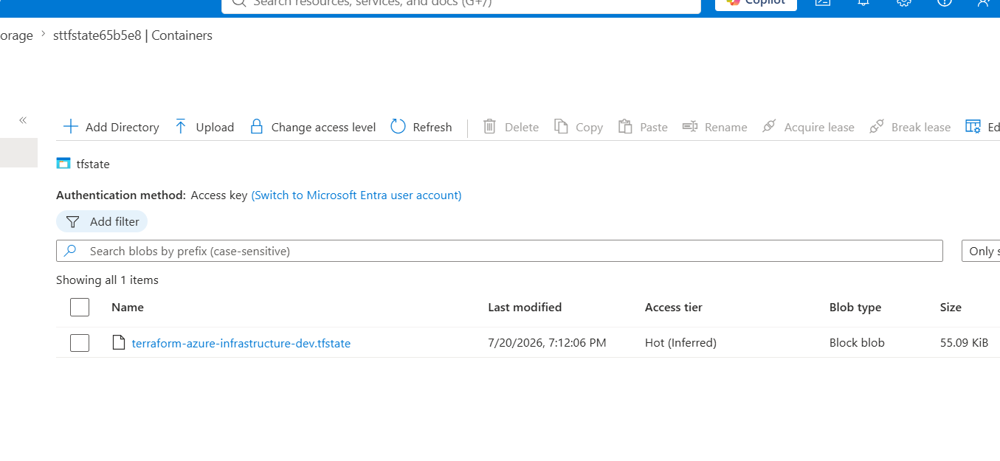

# Terraform Azure Infrastructure

[](https://developer.hashicorp.com/terraform)
[](https://azure.microsoft.com/)
[](https://github.com/ShivamP63/terraform-azure-infrastructure/actions/workflows/terraform-validate.yml)

A modular Terraform portfolio project that deploys a small Azure environment with networking, Linux compute, private Blob storage, centralized monitoring, remote state, and alerting.

The repository began as a flat Terraform configuration and was incrementally refactored into reusable modules. Terraform `moved` blocks preserved the existing resource state throughout the refactor; the final verification returned **0 to add, 0 to change, 0 to destroy**.



## What this project demonstrates

- Infrastructure as Code with Terraform and the AzureRM provider
- Reusable modules for networking, compute, storage, and monitoring
- Azure Storage remote state with state locking
- Linux VM deployment using SSH key authentication and a system-assigned managed identity
- Network segmentation with separate web and management subnets
- NSG rules for HTTP, HTTPS, and administrator-scoped SSH
- Azure Monitor Agent, Data Collection Rule, and Log Analytics integration
- CPU metric alerting through an Azure Monitor action group
- Centralized resource tagging and input validation
- Safe refactoring of live Terraform state with `moved` blocks
- Automated formatting and validation with GitHub Actions

## Architecture



A more detailed explanation is available in [docs/architecture.md](docs/architecture.md).

## Deployed resources

| Area | Azure resources |
|---|---|
| Foundation | Resource group and common tags |
| Networking | VNet, web subnet, management subnet, NSG, subnet association, public IP, NIC |
| Compute | Ubuntu 22.04 Linux VM, SSH key authentication, boot diagnostics, managed identity |
| Storage | StorageV2 account, private Blob container, versioning and delete retention |
| Monitoring | Log Analytics workspace, Azure Monitor Agent, DCR, VM association, action group, CPU alert |
| State | Separate Azure Storage account and Blob container for remote Terraform state |

## Repository structure

```text
.
├── .github/workflows/terraform-validate.yml
├── docs/
│   ├── architecture.md
│   ├── deployment-guide.md
│   ├── interview-notes.md
│   └── screenshots/
├── modules/
│   ├── compute/
│   ├── monitoring/
│   ├── networking/
│   └── storage/
├── runbooks/cleanup.md
├── scripts/destroy.sh
├── alerts.tf
├── compute.tf
├── locals.tf
├── main.tf
├── monitoring.tf
├── network.tf
├── outputs.tf
├── providers.tf
├── storage.tf
├── terraform.tfvars.example
├── variables.tf
└── versions.tf
```

The root configuration composes the modules and passes resource IDs between them. For example, the networking module exports the web subnet ID to the compute module, while the compute module exports the VM ID to the monitoring module.

## Prerequisites

- An Azure subscription
- Azure CLI
- Terraform 1.10 or later
- Git
- An SSH key pair
- A pre-created Azure Storage backend for remote state

## Configure and deploy

1. Sign in and select the correct Azure subscription:

   ```bash
   az login
   az account set --subscription "<subscription-id>"
   az account show --output table
   ```

2. Copy the example variable file:

   ```bash
   cp terraform.tfvars.example terraform.tfvars
   ```

3. Replace every placeholder in `terraform.tfvars` with your own values. Never commit this file.

4. Initialize the Azure backend. The backend values are deliberately supplied outside source control:

   ```bash
   terraform init \
     -backend-config="resource_group_name=<state-resource-group>" \
     -backend-config="storage_account_name=<state-storage-account>" \
     -backend-config="container_name=<state-container>" \
     -backend-config="key=terraform-azure-infrastructure-dev.tfstate"
   ```

5. Format, validate, and review the plan:

   ```bash
   terraform fmt -recursive
   terraform validate
   terraform plan
   ```

6. Deploy only after reviewing the plan:

   ```bash
   terraform apply
   ```

For expanded instructions, see [docs/deployment-guide.md](docs/deployment-guide.md).

## Verification

The completed refactor was verified with a clean plan:



```text
Plan: 0 to add, 0 to change, 0 to destroy.
```

The remote state is stored in Azure Blob Storage:



## Security decisions

- Password authentication is disabled on the VM.
- SSH is restricted to the administrator CIDR supplied through `allowed_ssh_source_address`.
- The VM uses a system-assigned managed identity.
- The application container is private and anonymous Blob access is disabled.
- HTTPS-only traffic and TLS 1.2 are enforced for the storage account.
- Terraform state, local variables, plans, and SSH keys are excluded from Git.
- Notification email and subscription ID variables are marked sensitive.

This is a portfolio environment rather than a production landing zone. Public network access remains enabled for the application storage account, and the VM has a public IP for demonstration. Production hardening would normally add private endpoints, Azure Bastion or a VPN, tighter outbound controls, Defender for Cloud, and centralized policy enforcement.

## Screenshots

| Evidence | Screenshot |
|---|---|
| Module structure | [View](docs/screenshots/02-module-structure.png) |
| Commit history | [View](docs/screenshots/03-commit-history.png) |
| VNet and subnets | [View](docs/screenshots/07-vnet-subnets.png) |
| NSG rules | [View](docs/screenshots/08-nsg-rules.png) |
| VM overview | [View](docs/screenshots/09-vm-overview.png) |
| Azure Monitor Agent | [View](docs/screenshots/10-azure-monitor-agent.png) |
| Private Blob container | [View](docs/screenshots/11-private-blob-container.png) |
| Log Analytics workspace | [View](docs/screenshots/12-log-analytics-workspace.png) |
| Data Collection Rule | [View](docs/screenshots/13-data-collection-rule.png) |
| Action group | [View](docs/screenshots/14-action-group.png) |
| CPU metric alert | [View](docs/screenshots/15-cpu-metric-alert.png) |

All published screenshots were cropped and redacted to remove account identifiers, subscription IDs, notification addresses, and public IP details where appropriate.

## Safe module refactor

The infrastructure was originally created with root-level resources. It was then moved into four modules without recreating Azure resources. Terraform `moved` blocks map each old resource address to its new module address, for example:

```hcl
moved {
  from = azurerm_linux_virtual_machine.web
  to   = module.compute.azurerm_linux_virtual_machine.web
}
```

Each module was migrated individually and accepted only after `terraform plan` reported no changes. This reduced risk and produced an auditable Git history.

## Cleanup

Read [runbooks/cleanup.md](runbooks/cleanup.md) before destroying resources. The included helper performs a plan first and requires explicit confirmation:

```bash
bash scripts/destroy.sh
```

The remote-state resource group is intentionally separate and must be removed only after the workload state is no longer needed.

## Lessons learned

- Refactor one module at a time and verify a zero-change plan after every state move.
- Keep backend infrastructure separate from the workload it manages.
- Pass resource IDs through module outputs instead of duplicating lookups.
- Centralized tags and validated variables improve consistency without making a small project overly complex.
- Portal evidence is useful, but Terraform state and a clean plan remain the authoritative proof of configuration.

## Interview notes

A concise walkthrough, design trade-offs, and likely interview questions are documented in [docs/interview-notes.md](docs/interview-notes.md).
