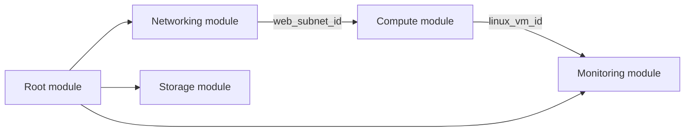
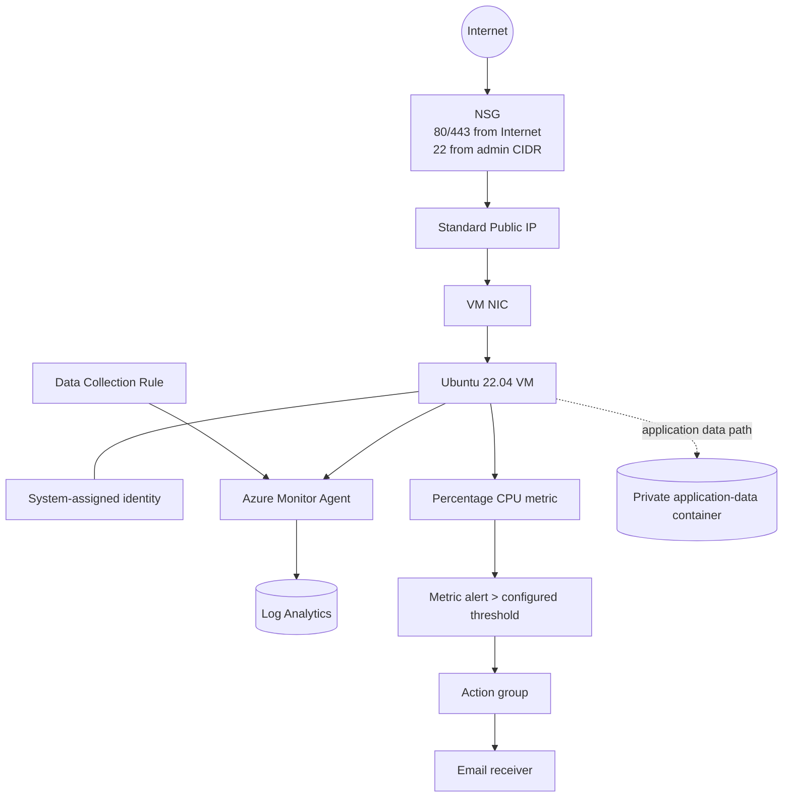

# Architecture

## Overview

This project deploys a single development environment in Azure Canada Central. Terraform runs from an administrator workstation, authenticates through Azure CLI, and stores state in a separate Azure Storage account.

The root module acts as the composition layer. It creates the resource group and invokes four child modules:

## Resource flow

## Networking

- VNet: `10.10.0.0/16`
- Web subnet: `10.10.1.0/24`
- Management subnet: `10.10.2.0/24`
- The NSG is associated with the web subnet.
- HTTP and HTTPS are permitted from the Internet for demonstration.
- SSH is permitted only from the administrator CIDR variable.
- The management subnet is reserved for future administrative services.

## Compute

The compute module creates a Standard public IP, NIC, and Ubuntu Linux VM. Password authentication is disabled; Terraform reads an existing public SSH key. Boot diagnostics and a system-assigned managed identity are enabled.

## Storage

The application StorageV2 account uses locally redundant storage, TLS 1.2, HTTPS-only traffic, Blob versioning, and seven-day deletion retention. The `application-data` container is private.

## Monitoring data path

1. The Azure Monitor Agent extension runs on the Linux VM.
2. A Data Collection Rule selects warning-and-higher Linux Syslog events from selected facilities.
3. The DCR association binds that rule to the VM.
4. Logs are delivered to the Log Analytics workspace.
5. Azure platform metrics independently feed the CPU metric alert.
6. When average CPU exceeds the configured threshold during the evaluation window, the action group sends an email notification.

## Remote state

The `azurerm` backend stores state as a Blob in a separate resource group. This avoids keeping state on the local workstation and provides Azure Blob lease-based state locking. Backend names are passed during `terraform init` rather than committed to the repository.

## Module boundaries

| Module | Responsibility | Important outputs |
|---|---|---|
| `networking` | VNet, subnets, NSG, association | web subnet ID, management subnet ID, VNet ID |
| `compute` | Public IP, NIC, Linux VM | VM ID, VM name, public/private IP |
| `storage` | Storage account and private container | account ID/name, container name |
| `monitoring` | Workspace, AMA, DCR, action group, CPU alert | workspace ID, DCR ID, alert/action-group IDs |

## Trade-offs and production improvements

This architecture is intentionally small enough for a junior portfolio project. A production implementation would likely:

- remove direct SSH exposure and use Azure Bastion, VPN, or private connectivity;
- use private endpoints for Storage and Log Analytics ingestion where required;
- apply Azure Policy and Defender for Cloud;
- separate environments into independent state files or directories;
- place backend creation in a bootstrap configuration;
- add workload availability zones, backup, patching, and disaster-recovery controls;
- use OIDC-based workload identity for CI instead of long-lived credentials.
